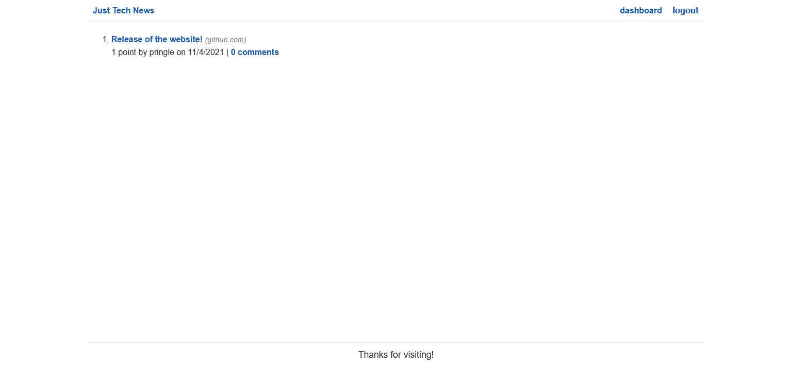

# just-tech-news

## Description
A simple blog site which allows for logging in/out, creating, editing, and deleting posts, as well as commenting on and upvoting those posts.

* [Github Source Repository](https://github.com/byampols/just-tech-news).
* [Visit the site here!](https://warm-peak-11797.herokuapp.com/)

## Table of Contents
1. [Usage](#usage)
2. [License](#license)
3. [Contributors](#contributors)
4. [Questions](#questions)

## Usage

* Press login to log into or sign up for the website using a username, password, and email address.
* Use your dashboard to create, edit, and delete your posts.
* See all posts on the homepage, click the title to go to the linked article/website, and click "# Comments" to go to the comments page, where you can comment on the site.

## License
[MIT License](https://opensource.org/licenses/MIT).

## Contributors
* [byampols](https://github.com/byampols)

## Questions
### [My github profile.](https://github.com/byampols)
### [Email me if you have any questions!](byampols@alumni.cmu.edu)
